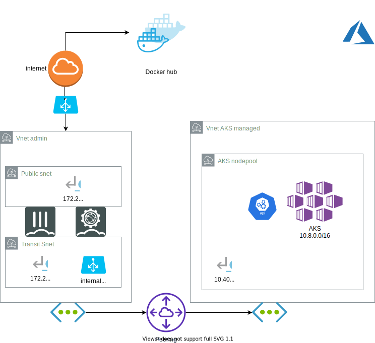

# Securing Azure managed Kubernetes (AKS)

This demo automate the deployment of a Fortigate a Fortiweb and an Azure managed Kubernetes (AKS) with private API feature.
The goal is to set the scene to help understand and secure with Fortinet solutions an AKS environment and applications.
It has been kept simple (1 Fortigate) for education and cost perspective. Contact a Fortinet representative for a completly scalable and automated solution.

# Bootstrap
Of course you need an Azure account with all necessary subscriptions and permissions.
Get the code
```
git clone https://github.com/fortinet-solutions-cse/fortistacks.git --recursive
cd fortistacks/Azure
```
## Using provided docker image
```
docker run -v $PWD:/Azure/  -i --name az-aks-cli  -h az-aks-cli -t fortinetsolutioncse/az-aks-cli
```

If like me you have internal SSL inspection you use the same image.
(Curious check the code).

```
export FGTCA=$(base64 Fortinet_CA_SSL.cer -b0)
# this is for MacOS use -w0 on Linux
docker run -v $PWD:/Azure/ -e FGTCA -i --name az-aks-cli  -h az-aks-cli -t fortinetsolutioncse/az-aks-cli
```


## Script
```
az login
./Secure-AKS.sh
```
The script will deploy the following and ensure all AKS traffic goes to the Firewall for analysis.
Again for education, feature it can be split and made elastic.


# Day 1
Apply configuration to the FGT.

```
ansible-playbook fgt-playbook.yaml -i hosts -e ansible_host=52.174.188.48
```

# Access the environment

## VPN to Fortigate

I recommend setting up an IPsec VPN access and use Forticlient VPN to get to the environment.
You can also choose to add a jumphost on the tranist network (it is the purpose of this intermediate to have tools to manage K8S there)

## Verify AKS works
https://docs.microsoft.com/en-us/azure/aks/kubernetes-walkthrough

## AKS dashboard 
(ref https://docs.microsoft.com/en-us/azure/aks/kubernetes-dashboard):
Dashboard is very limited by default (good for security)

```
kubectl create clusterrolebinding kubernetes-dashboard --clusterrole=cluster-admin --serviceaccount=kube-system:kubernetes-dashboard
kubectl describe services kubernetes-dashboard --namespace=kube-system
```

You can then access with the IP:PORT provided.
## Scale
# Debug 


# SSH access to nodes (VMs) for debug

Using the script you should have a direct ssh accesss to the nodes (VMs) with the user which create the cluster.

If not ref: https://docs.microsoft.com/en-us/azure/aks/ssh (for debug)


```
az@az-aks-cli:/Azure $kubectl get nodes -o wide
NAME                                STATUS   ROLES   AGE   VERSION    INTERNAL-IP   EXTERNAL-IP   OS-IMAGE             KERNEL-VERSION      CONTAINER-RUNTIME
aks-nodepool1-13072840-vmss000000   Ready    agent   61m   v1.15.10   10.40.0.4     <none>        Ubuntu 16.04.6 LTS   4.15.0-1071-azure   docker://3.0.10+azure
aks-nodepool1-13072840-vmss000001   Ready    agent   61m   v1.15.10   10.40.0.35    <none>        Ubuntu 16.04.6 LTS   4.15.0-1071-azure   docker://3.0.10+azure
az@az-aks-cli:/Azure $ssh azureuser@10.40.0.4 
```
The above example should be successfull. This allow you to see the work done on Kubernetes nodes (docker cli).
You should NOT allow this in production.

# SSL inspection
## K8S Nodes (i.e. VMs)
Ref https://docs.microsoft.com/en-us/azure/virtual-machines/extensions/custom-script-linux
You get the Fortinet_AKS_CA.crt from your running Fortigate in the custom deep inspection security profile download.

```
export FGTCA=$(base64 Fortinet_AKS_CA.cer -w0) # or -b0 on MacOS
GROUP_NAME="fortistacks-aks"
CLUSTER_RESOURCE_GROUP=$(az aks show --resource-group $GROUP_NAME --name secure-aks --query nodeResourceGroup -o tsv) 
SCALE_SET_NAME=$(az vmss list --resource-group $CLUSTER_RESOURCE_GROUP --query [0].name -o tsv)

az vmss extension set      --resource-group $CLUSTER_RESOURCE_GROUP     --vmss-name $SCALE_SET_NAME   \
    --version 2.0 --publisher Microsoft.Azure.Extensions     --name CustomScript    \
    --protected-settings "{\"commandToExecute\": \"echo $FGTCA| base64 -d > /usr/local/share/ca-certificates/Fortinet_CA_SSL.crt ; update-ca-certificates --fresh; service docker restart \"}"

az vmss update-instances --instance-ids '*' \
    --resource-group $CLUSTER_RESOURCE_GROUP \
    --name $SCALE_SET_NAME
```

This install and trust the Fortigate CA for SSL inspection, allowing antivirus and DLP on your infra and application code.
You must at least restart the docker deamon on nodes.

## quick test

```
kubectl run eicar --image=fortinetsolutioncse/ubuntu-eicar bash -it
```

Should trigger the antivirus
## K8S containers

# Helm development
https://docs.microsoft.com/en-us/azure/aks/quickstart-helm